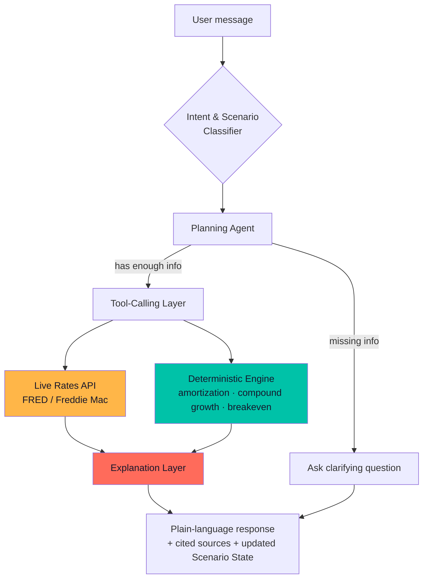

<div align="center">


<br/>

[](#)
[](#)
[](#)
[](#)
[](#)


</div>

<br/>

## Table of Contents

- [The Problem](#-the-problem)
- [The Idea](#-the-idea)
- [Live Demo](#-live-demo)
- [Features](#-features)
- [Agent Architecture](#-agent-architecture)
- [Tech Stack](#-tech-stack)
- [Privacy by Design](#-privacy-by-design)
- [Getting Started](#-getting-started)
- [Roadmap](#-roadmap)
- [Design System — "The Current"](#-design-system--the-current)
- [License](#-license)

<br/>

## 🧩 The Problem

Existing financial tools fall into two failure modes:

| | The problem |
|---|---|
| 🧮 **Static calculators** | Accurate math, zero reasoning. No follow-up questions. No memory of context. Ask "what if I put more down?" and you start over from scratch. |
| 🏦 **Full finance apps** (Mint, YNAB, Rocket Money) | Powerful — but require **linking your real bank account**. This is the single biggest trust barrier keeping privacy-conscious people away from financial planning tools entirely. |

There was no tool that combined **conversational, agentic reasoning** with **zero account-linking** — until now.

<br/>

## 💡 The Idea

**FinScenario** is an agentic financial "what-if" simulator. You describe your situation in plain language — no forms, no document uploads, no bank login — and an AI agent:

1. Asks for whatever it's missing (never guesses silently)
2. Pulls **live public data** (current mortgage rates, inflation, market averages) with full source citations
3. Runs the actual math through a **deterministic Python engine** — not the LLM's imagination
4. Explains the tradeoff in plain English
5. Lets you keep asking "what if" — and it remembers everything

> **"Every big decision has two columns. FinScenario shows you the honest bottom line — without ever touching your bank account."**

<br/>

## 🎬 Live Demo

<div align="center">


<sub>*(Replace this with your actual screen recording — land on homepage → try live demo → sign up → create a scenario → ask a "what if" follow-up)*</sub>
</div>

**[→ Try it live](#)** &nbsp;|&nbsp; **[→ Watch the 90-second walkthrough](#)**

<br/>

## ✨ Features

<table>
<tr>
<td width="33%" valign="top">

### 🗣️ Conversational
No forms. Describe your situation like you're talking to a smart friend. The agent asks clarifying questions instead of guessing.

</td>
<td width="33%" valign="top">

### 🔁 Iterative "What-If"
*"What if I put 20% down instead?"* — the agent recalculates using your existing context, not from zero.

</td>
<td width="33%" valign="top">

### 📊 Explainable, Always
Every number is tagged: user-provided, live data (with source + date), or estimate. Nothing is invented silently.

</td>
</tr>
</table>

| Scenario Type | What it compares |
|---|---|
| 🏠 **Rent vs. Buy** | Monthly rent vs. mortgage + tax + maintenance − equity/appreciation |
| 🚗 **Lease vs. Buy (Car)** | Lease payments vs. loan + resale value over your ownership window |
| 💳 **Debt vs. Invest** | Paying down debt vs. investing, weighed against expected market return |

<br/>

## 🤖 Agent Architecture

The core design principle: **the LLM never does the arithmetic.**



**Why this matters:** naive "AI finance" demos let the LLM compute the numbers directly — a classic hallucination risk. Here, all math (loan amortization, compound interest, breakeven analysis) runs through tested, deterministic Python functions. The agent's only job is orchestration and explanation.

<br/>

## 🛠️ Tech Stack

<div align="center">

| Layer | Technology |
|---|---|
| Frontend (Desktop) |    |
| Backend |   |
| Database & Auth |   |
| Agent Orchestration | LLM tool-calling loop (rates API, calculation engine, explanation layer) |
| Data Sources | FRED (Federal Reserve Economic Data), public market index data |
| Mobile *(planned)* |  |

</div>

<br/>

## 🔒 Privacy by Design

This isn't a feature bullet point tacked on at the end — it's the reason the product exists.

- ❌ **No account linking.** No Plaid, no bank OAuth, no financial institution integration, ever.
- ❌ **No document uploads.** No pay stubs, bank statements, or credit reports.
- ✅ **Self-reported only.** Every number is typed or spoken by you — editable and deletable anytime.
- ✅ **Enforced at the database level**, not just in application code — Postgres Row-Level Security ensures a user can *only* ever query their own data, verified independently of the API layer.
- ✅ **Every live data point cited** — source name + date, always visible.

<br/>

## 🚀 Getting Started

<details>
<summary><b>Click to expand setup instructions</b></summary>

<br/>

### Prerequisites
- Python 3.11+
- Node.js 18+
- A [Supabase](https://supabase.com) project

### Backend
```bash
cd backend
python -m venv venv
source venv/bin/activate  # Windows: venv\Scripts\activate
pip install -r requirements.txt --break-system-packages
cp .env.example .env       # fill in your Supabase + API credentials
alembic upgrade head
uvicorn app.main:app --reload
```

### Frontend
```bash
cd frontend
npm install
cp .env.example .env       # fill in VITE_SUPABASE_URL and VITE_SUPABASE_ANON_KEY
npm run dev
```

Visit `http://localhost:5173` and you're in.

</details>

<br/>

## 🗺️ Roadmap

- [x] Deterministic financial engine (Rent vs. Buy, Lease vs. Buy Car, Debt vs. Invest)
- [x] Live public data integration with citations
- [x] Agentic conversational layer (tool-calling, clarifying questions, "what-if" memory)
- [x] Desktop app — landing, auth, onboarding, scenario chat, comparison workspace
- [x] Supabase database + Row-Level Security
- [x] Email verification, forgot password, Google sign-in
- [ ] Deployment (live URL)
- [ ] 📱 Mobile app (Flutter) — voice-first "what-if" queries, quick-capture, push reminders

<br/>

## 🎨 Design System — "The Current"

The UI is built around a single idea: FinScenario shows two choices racing against each other. So the signature interactive element — **The Current** — is a pair of glowing liquid tubes that race in real time as you adjust your numbers, glowing toward whichever option wins.

<div align="center">

</div>

No dark cyberpunk. No generic gradient-button SaaS look. Light, glassy, spring-physics motion throughout — every animation explains something, none of it is decoration for its own sake.

<br/>

<div align="center">

## 📄 License

Distributed under the MIT License.

<br/>

<a href="#finscenario"></a>


</div>
